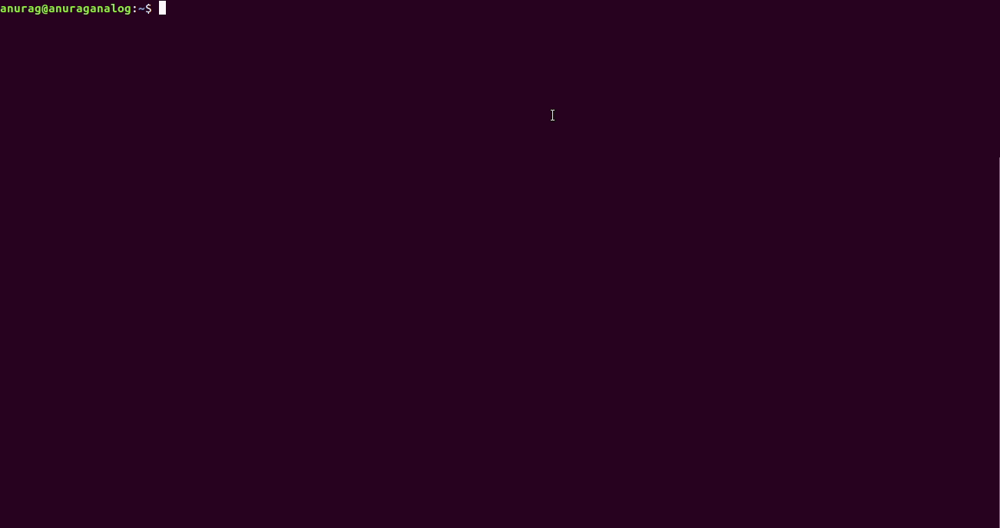
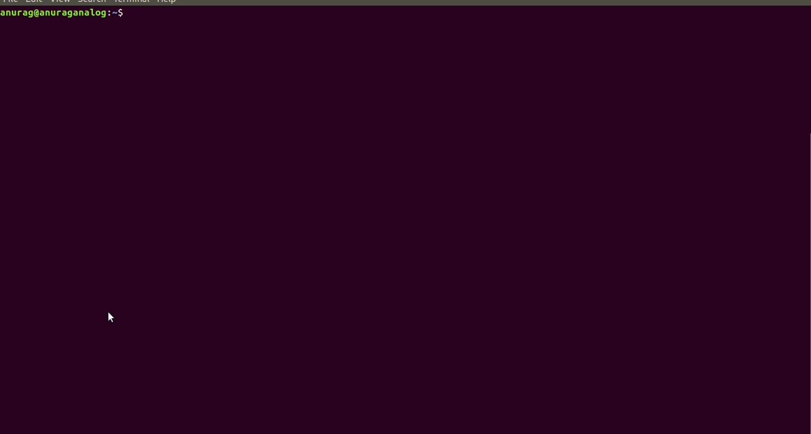
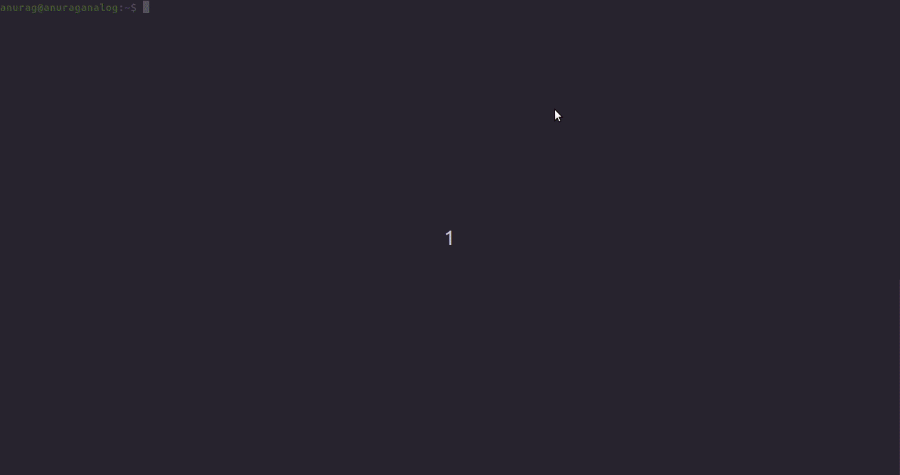
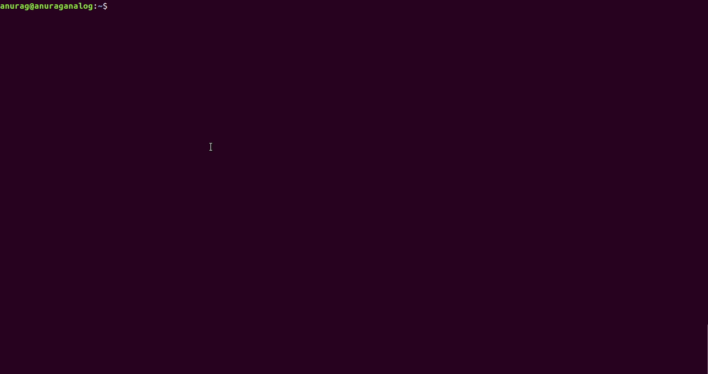

# Installation Procedure

## Linux Users

### Pre installation

Before installing the module, run the below command at your prompt to install the graphviz
```shell
$ sudo apt install graphviz
```

### Normal installation
```shell
$ sudo pip3 install neuralnet-visualize
```

### Development installation
```shell
$ git clone https://github.com/AnuragAnalog/nn_visualize.git
$ cd nn_visualize
```

### Post installation

After installing the module, if you want to upgrade the module, run the below command.
```shell
sudo pip3 install neuralnet-visualize --upgrade
```

### Screencasts

#### Pre installation


#### Installation


#### Development installation


#### Post installation
