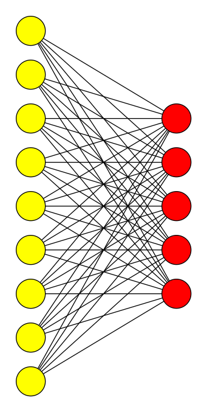
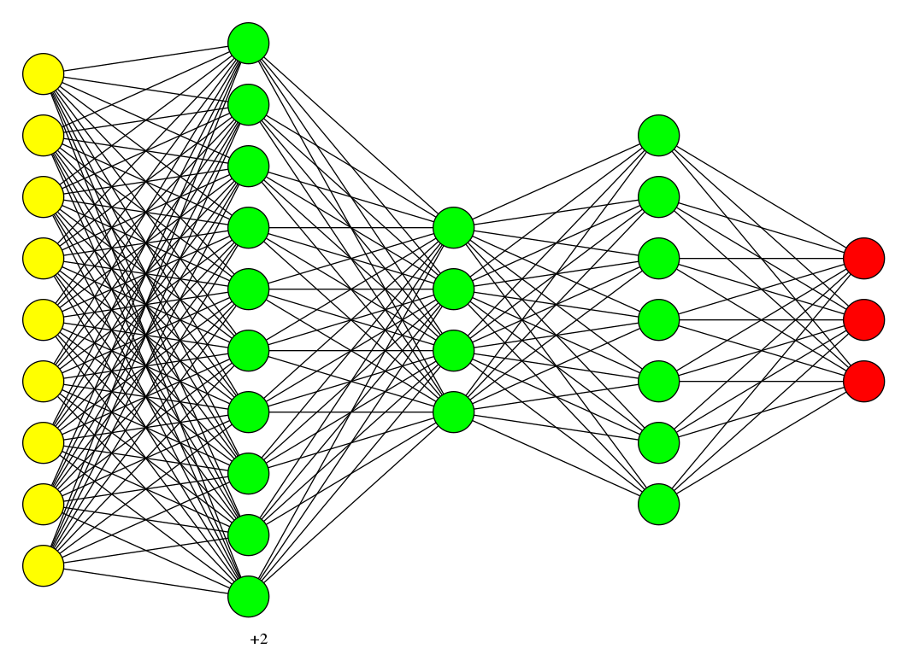

# Some Examples of how to use Neural Network Visualizer

**basic_nn.py**

A simple(shallow) Neural Network with the following architecture:

* Input: 9
* Output: 5

**basic_dnn.py**

A Deep Neural Network with the following architecture:

* Input: 9
* Hidden1: 12
* Hidden2: 4
* Hidden3: 7
* Output: 3

A Convolutional Network with the following architecture:

* Input Conv2d: kernel 5x5
* Hidden1: 12
* Output: 4